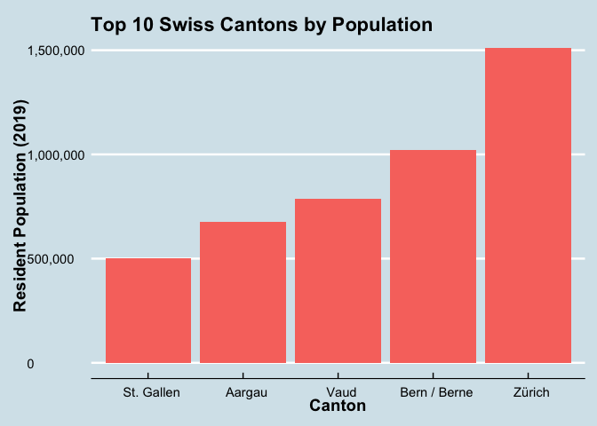
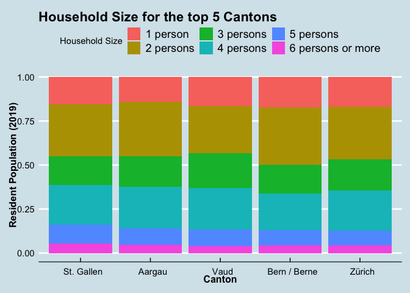

Swiss Cantons
================
Marco Giordano
12/24/2020

## Introduction

What if you don’t find the plots you wish for online? Well, you actually
have to make your own\! I had this problem for a project where I had to
gather some data by myself and show my findings. There were a lot of
plots available but no one suited what I wanted to communicate. For this
reason, I extracted data from the official Swiss Confederation website
and cleaned them where necessary. After that, it was just a matter of
transformations and plotting.

I included data in the “Data” folder so be sure to take a look at it if
you want to replicate the result. You can find the link to the
interactive tables below, wherein you can select what data you wish to
include and then download them.

Source: [Swiss Confederation
website](https://www.pxweb.bfs.admin.ch/pxweb/en/px-x-0102020000_401/px-x-0102020000_401/px-x-0102020000_401.px)

``` r
library(tidyverse)
```

    ## ── Attaching packages ─────────────────────────────────────── tidyverse 1.3.0 ──

    ## ✓ ggplot2 3.3.2     ✓ purrr   0.3.4
    ## ✓ tibble  3.0.4     ✓ dplyr   1.0.2
    ## ✓ tidyr   1.1.2     ✓ stringr 1.4.0
    ## ✓ readr   1.4.0     ✓ forcats 0.5.0

    ## ── Conflicts ────────────────────────────────────────── tidyverse_conflicts() ──
    ## x dplyr::filter() masks stats::filter()
    ## x dplyr::lag()    masks stats::lag()

``` r
library(ggthemes)
library(scales)
```

    ## 
    ## Attaching package: 'scales'

    ## The following object is masked from 'package:purrr':
    ## 
    ##     discard

    ## The following object is masked from 'package:readr':
    ## 
    ##     col_factor

We load the raw data into R, considering that the encoding must be
“latin1”, otherwise you are likely to get problems while visualizing
umlauts\!

After we load the raw data, we have to process them since they are
unusable in this format. e have to split a column into multiple, using
the semicolon as a separator and then converting each new column to the
right datatype.

``` r
swiss_data <- separate(swiss_data, col = 'Permanent.resident.population.in.private.households.by.institutional.units.and.household.size', into = c('Canton', 'Household_Size', 'Resident_Population'), sep = ';')
swiss_data <- swiss_data[-c(1,7),]
swiss_prova <- swiss_data[str_detect(swiss_data$Canton, '^-'),]
swiss_prova$Canton <- str_replace_all(swiss_prova$Canton, '^-', ' ')
swiss_prova$Resident_Population <- as.integer(swiss_prova$Resident_Population)
swiss_prova$Household_Size <- as.factor(swiss_prova$Household_Size)
```

Now we are ready to apply some transformations to the data and then
plot. Our goal is to find the top 5 Cantons by resident population, so
we group by canton first and then calculate the total resident
population for each of them and then sort.

``` r
swiss_data_top <- swiss_prova %>%
  group_by(Canton)%>%
  summarise(tot_pop = sum(Resident_Population)) %>%
  arrange(desc(tot_pop)) %>%
  ungroup() %>%
  top_n(5, tot_pop)
```

    ## `summarise()` ungrouping output (override with `.groups` argument)

With our ordered data, we are only left with the plotting part. A
barplot is one of the simplest but also most effective ways to show
something. Originally, I had ordered data to find the top 10 Cantons but
due to problems with the markdown, I have opted to pick 5, the concept
is still the same\!

``` r
ggplot(swiss_data_top, aes(reorder(Canton, tot_pop), tot_pop, fill = 'red')) +
  geom_col() +
  theme_economist() +
  scale_color_economist() +
  theme(axis.title=element_text(size=14,face="bold")) +
  scale_y_continuous(labels = scales::comma) +
  #theme(panel.grid.major = element_blank(), panel.grid.minor = element_blank()) +
  ggtitle('Top 10 Swiss Cantons by Population') +
  xlab('Canton') +
  ylab('Resident Population (2019)') +
  guides(fill = FALSE)
```

<!-- -->

As you can see above, 4 out of 5 are Swiss German Cantons, where Zürich
naturally comes at the top as many could suspect. It is interesting to
notice that Vaud (French Switzerland) is the only one in top 5 which is
not German-speaking. We can clearly see the discrepancy between the
first and the second place, with around half a million of difference in
terms of resident population.

Now that we know which are the top Cantons, we are interested in knowing
the composition according to the household size, we have to transform
starting data differently.

``` r
swiss_data_house <- swiss_prova %>%
  group_by(Canton) %>%
  mutate(tot_pop = sum(Resident_Population)) %>%
  ungroup() %>%
  top_n(30, tot_pop) %>%
  group_by(Canton, Household_Size) %>%
  arrange(desc(Resident_Population)) %>%
  ungroup()
```

Once we do that, we are ready to plot what we want by using a stacked
barplot where one can visualize the distribution of the household size
by Canton.

``` r
ggplot(swiss_data_house, aes(reorder(Canton, Resident_Population), Resident_Population, fill = Household_Size)) +
  geom_bar(stat = 'identity', position = 'fill') +
  theme_economist() +
  scale_color_economist() +
  theme(axis.title=element_text(size=12,face="bold")) +
  scale_y_continuous(labels = scales::comma) +
  #theme(panel.grid.major = element_blank(), panel.grid.minor = element_blank()) +
  ggtitle('Household Size for the top 5 Cantons') +
  xlab('Canton') +
  ylab('Resident Population (2019)') +
  guides(fill=guide_legend(title="Household Size"))
```

<!-- -->

It is easy to see that there is a pretty similar distribution of
household sizes across the top 5 Cantons, although one can look at which
one is interested in. Consider also that around 50% of the population
across the top Cantons is split into households of 3 or more persons.
